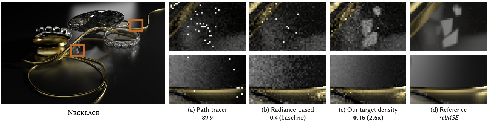

## Variance-Aware Path Guiding

This repository contains the authors' implementation of the ["Variance-Aware Path Guiding"](https://graphics.cg.uni-saarland.de/publications/rath-2020-siggraph-guiding.html) guiding target function as demonstrated in ["Practical Path Guiding for Efficient Light-Transport Simulation" [Müller et al. 2017]](https://tom94.net).

## Selecting the guiding distribution

In addition to the parameters of the [original implementation](https://github.com/Tom94/practical-path-guiding), we add the following parameters that allow switching between the previous guiding target function and our proposed target functions.
These can be set in the Mitsuba GUI or in the scene files by using their property name (denoted by the `monospace text` in brackets).

### Guiding Distribution (`distribution`)
The guiding distribution that should be approximated.
The following values are valid:
* `radiance`: Guiding distribution used by previous works.
* `simple`: Approximates parts of the integrand.  
  Robust for very short renders (< 10 seconds), but worse than `full` for longer renders
* `full`: Approximates the full integrand.  
  Recommended for longer renders (> 10 seconds), otherwise use `simple`

Default = `radiance` (for reproducibility)  
Recommended = `full` (as evaluated in our paper)

### DI strategy (`diStrategy`)
The strategy for direct illumination guiding.
The following values are valid:
* `no`: Do not guide towards direct illumination [Mueller et al. 2017].
* `unweighted`: Guide direct illumination, ignoring MIS [Mueller et al. 2017, kickstart].
* `weighted`: Guide direct illumination weighted by MIS weights.

Default = `no` (for reproducibility)  
Recommended = `no` (for robustness, as evaluated in our paper)

## Compilation

### Mitsuba

To compile the Mitsuba code, please follow the instructions from the [Mitsuba documentation](http://mitsuba-renderer.org/docs.html) (sections 4.1.1 through 4.6). Since our new code uses C++11 features, a slightly more recent compiler and dependencies than reported in the mitsuba documentation may be required. We only support compiling mitsuba with the [scons](https://www.scons.org) build system.

We tested our Mitsuba code on
- Windows (Visual Studio 2013 Win64, custom dependencies via `git clone https://github.com/Tom94/mitsuba-dependencies-windows mitsuba/dependencies`)
- macOS (High Sierra / Mojave, custom dependencies via `git clone https://github.com/Tom94/mitsuba-dependencies-macOS mitsuba/dependencies`)
- Linux (GCC 6.3.1)

### Visualization Tool

The visualization tool, found in the *visualizer* subfolder, uses the [CMake](https://cmake.org/) build system. Simply invoke the CMake generator on the *visualizer* subfolder to generate Visual Studio project files on Windows, and a Makefile on Linux / OS X.

The visualization tool was tested on
- Windows (Visual Studio 2013-2017 Win64)
- macOS (High Sierra)
- Linux (GCC 6.3.1)

## License

The new code introduced by this project is licensed under the GNU General Public License (Version 3). Please consult the bundled LICENSE file for the full license text.

The bundled KITCHEN scene is governed by the [CC-BY 3.0 license](https://creativecommons.org/licenses/by/3.0/).
